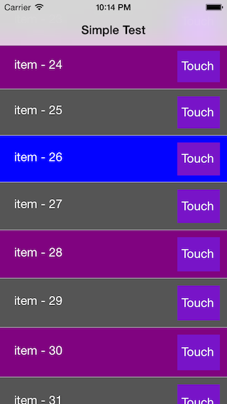
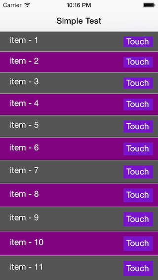

ChopeTableController
=======

It is not subclass of UITableViewController.

Implemention of UITableViewDataSource, UITableViewDelegate.


[TOC]

##Implements ChopeTableCellDelegate
```objective-c
@interface CPSimpleTableViewCell : UITableViewCell <ChopeTableCellDelegate>

@property (nonatomic, weak) IBOutlet UILabel *titleLabel;

@end

@implementation CPSimpleTableViewCell

- (void)willMoveToSuperview:(UIView *)newSuperview {
    [super willMoveToSuperview:newSuperview];
    
    [self.titleLabel setTextColor:[UIColor whiteColor]];
}

+ (CGFloat)heightForCell:(id)data indexPath:(NSIndexPath *)indexPath {
    return 40 + (indexPath.row+1);
}

- (void)updateData:(id)data indexPath:(NSIndexPath *)indexPath {
    [self.titleLabel setText:data];
    [self setNormalBackgroundColor:indexPath];
}

- (void)setNormalBackgroundColor:(NSIndexPath *)indexPath {
    if (indexPath.row % 2 == 0) {
        [self setBackgroundColor:[UIColor darkGrayColor]];
    }
    else {
        [self setBackgroundColor:[UIColor purpleColor]];
    }
}

- (void)selectedWithData:(id)data indexPath:(NSIndexPath *)indexPath {
    [self setBackgroundColor:[UIColor blueColor]];
}

- (void)deselectedWithData:(id)data indexPath:(NSIndexPath *)indexPath {
    [self setNormalBackgroundColor:indexPath];
}

- (void)highlightedWithData:(id)data indexPath:(NSIndexPath *)indexPath {
    [self setBackgroundColor:[UIColor redColor]];
}

- (void)unhighlightedWithData:(id)data indexPath:(NSIndexPath *)indexPath {
    [self setNormalBackgroundColor:indexPath];
}

@end
```

##Create ChopeTableController
```objective-c
self.tableController = [[ChopeTableController alloc] init];
```

##Set Table Information

```objective-c
ChopeTableInfo *tableViewInfo = [self.tableController addTableInfo:self.tableView paging:NO];
[tableViewInfo addCellClass:[CPSimpleTableViewCell class] cellIdentifier:CELL_IDENTIFIER_LABEL];
[tableViewInfo setDidLoadCellBlock:^(ChopeTableInfo *tableInfo, id <ChopeTableCellDelegate> cellDelegate, NSIndexPath *indexPath) {
        CPSimpleTableViewCell *cell = (CPSimpleTableViewCell *) cellDelegate;
        cell.button.tag = indexPath.row;
        [cell.button addTarget:self action:@selector(touchTestButton:) forControlEvents:UIControlEventTouchUpInside];
}];
[tableViewInfo setDidSelectRowBlock:^(ChopeTableInfo *cpTableInfo, NSIndexPath *indexPath) {
        NSLog(@"selected cell : %d", indexPath.row);
}];
```
`paging:YES` is not tested.

##Add Data
cell information is about one cell.
- Cell Class
- Cell identifier


```objective-c
for (NSUInteger i=1; i<=100; i++) {
    [tableViewInfo addData:[NSString stringWithFormat:@"item - %d", i] cellIdentifier:CELL_IDENTIFIER_LABEL];
}
```

## Screenshot




## License

ChopeTableController is available under the MIT license. See the LICENSE file for more info.